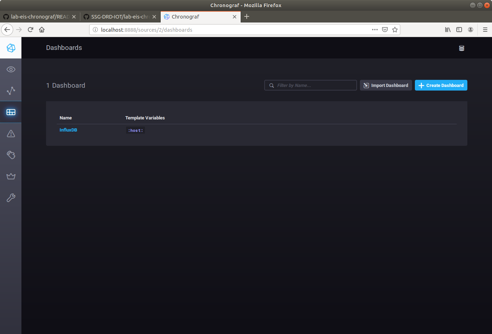
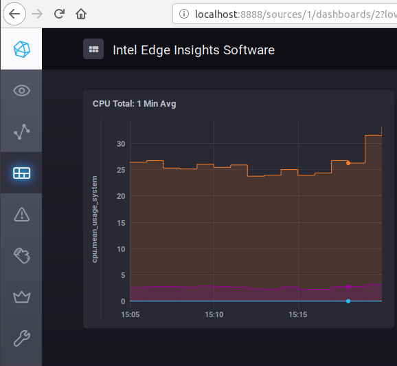

# Human-Machine Interfaces with Chronograf

## Using Chronograf

Chronograf is a web application that allows you to build dashboard style data widgets from a variety of source such as InfluxDB for alerts from Kapacitor. Chronograph is an example of a human machine interface (HMI). Human machine interfaces are flexible software programs that allow people to control and receive analytics from different network enabled industry 4.0 machines.


With chronograph you can do the following:
* Infrastructure monitoring
* Alert management
* Data visualization
* Database management
* Multi-organizational or multi-user support

Pre-created dashboards

Chronograph has a large number of precreated dashboards to help you jumpstart your HMI.

* apache
* consul
* docker
* elasticsearch
* haproxy
* iis
* influxdb
* kubernetes
* memcached
* mesos
* mysql
* nginx
* nsq
* phpfpm
* ping
* postgresql
* rabbitmq
* redis
* riak
* system
* varnish
* win_system

### Install and Launch Chronograf

```
cd ~/Downloads
wget https://dl.influxdata.com/chronograf/releases/chronograf_1.7.14_amd64.deb
sudo dpkg -i chronograf_1.7.14_amd64.deb
chronograf
```

### Configurating Telegraf to Collect CPU Utilization Measurements

Go to the **docker_setup** directory and open the **config/telegraf.conf** file

Go to the INPUT PLUGINS section of the configuration file. This section begins at **line 1277**. If you are using vim type **:1277** to jump to the line.


remove all the `#` comments to match the above image, hit "esc", type `:wq`, and hit "Enter"

Then rebuild and restart the Intel Edge Insights Software services

```
cd /home/eis/Workshop/IEdgeInsights-v1.5LTS/docker_setup
sudo make build run
```
### Starting Chronograf

Now open a browser and go to **http://localhost:8888**

You will have to connect to the InfluxDB database that is running as part of EIS.

Use the following settings:
- connection URL: https://localhost:8086
- Connection Name: Influx 1
- Username: admin
- Password: admin123

Select the "Unsafe SSL" switch


When asked to create dashboard select the InfluxDB option. 

You can skip the rest of the settings and connections for this lab. 

### Dashboards

On the left, you will see a menu bar. Click on the **Dashboards** link and select the **InfluxDB** dashboard.



You will be presented with chronograf's initial interface.


Here you see links to instructions on how to configure Telegrah to capture different system metrics.

### Exploring Data

Next go to the left menu bar and click on the **Explore** menu item. 
This will bring you to a screen that let's you explore the measurements that are being recorded by InfluxDB.

### Configurating Chronograf


Let's type a query and display the results.  This query will select the cpu system utilization and the cpu user utilization measurements averaged over a 1 minute intervals.

```sql
SELECT mean("usage_system") AS "mean_usage_system", mean("usage_user") AS "mean_usage_user", mean("usage_guest") AS "mean_usage_guest" FROM "datain"."autogen"."cpu" WHERE time > :dashboardTime: AND "cpu"='cpu-total' GROUP BY time(1m) FILL(null)
```


Now go to the upper right side of Chronograf and select the button that says **Send to Dashboard**

Give your dashboard the name **Intel Edge Insights Software** and label the cell name as **CPU Total: 1 Min Avg**


Now if you go back to the **dashboard** screen, you will see a new dashboard named, Intel Edge Insights Software. The dashboard contains the **CPU Total: 1 Min Avg** data cell.


### Visualizing

To convert this table of measurements into a chart, go to the dashboard and click on the edit icon and select **configure** in the top right of the cell.

Now at the top select **Visualization**. The visualization options are easy to use and quite extensive.

Select **Step Plot** chart in the lower left.

** You now have a Step-Plot of your systems CPU Utilization **




## Adding the Simulated Temperature Data to the HMI

Now that you've add the CPU utilization over 1 minute intervals to the dashboard, let repeat the process for our simulated data that we configured in the time series lab.

Here are the steps:

1. Go to the Explore Page and enter the following query:

```sql
SELECT mean("temperature") AS "mean_temperature" FROM "datain"."autogen"."point_data" WHERE time > :dashboardTime: AND "topic"='temperature/simulated/0' GROUP BY time(1m) FILL(null)
```

2. Click on the **Visualization** button at the top center of the screen
3. Choose the **Bar** graph. 
4. Click on the **Send to Dashboard** button in the top right of the screen.
5. Choose the **Intel Edge Insights Software** dashboard and give it the cell name of **Temperature: 1 Min Avg**

You should now have a dashboard with two cells displaying the CPU Utilization and Temperature: 1 Min Avg graphs.

## Conclusion 

Congratulations! You have successfully configured telegraph to collect CPU and temperature data, entered queries for both the CPU and the simulated temperature data, and converted those into cells that can be displayed on a HMI dashboard.

Spend a little bit of time setting up your own data cells. Try to be creative and show your information in an interesting way.


